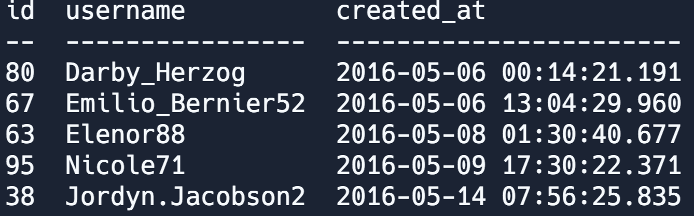
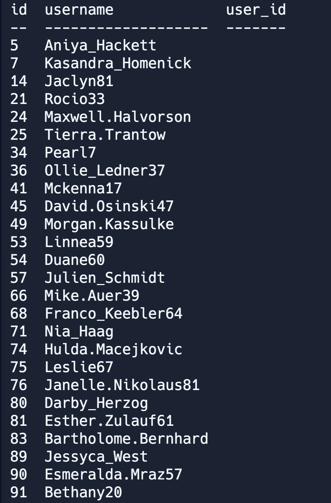
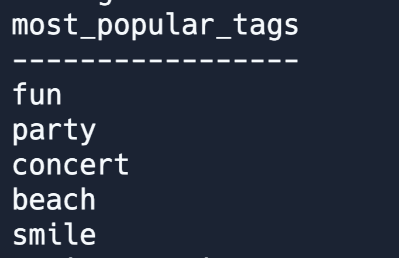
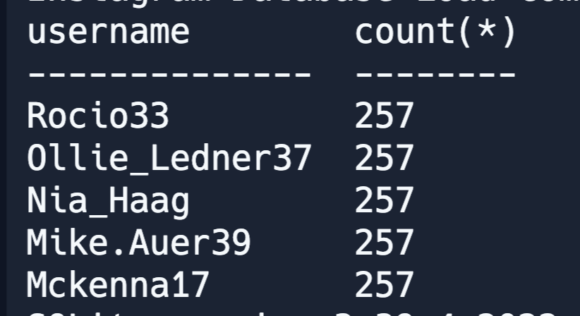
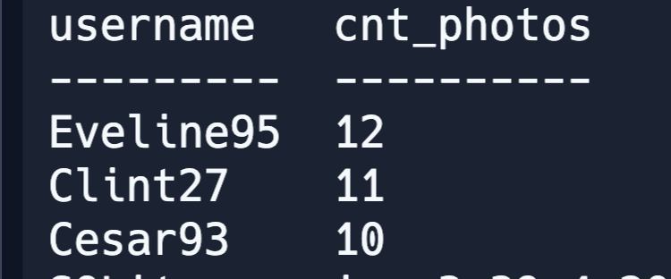
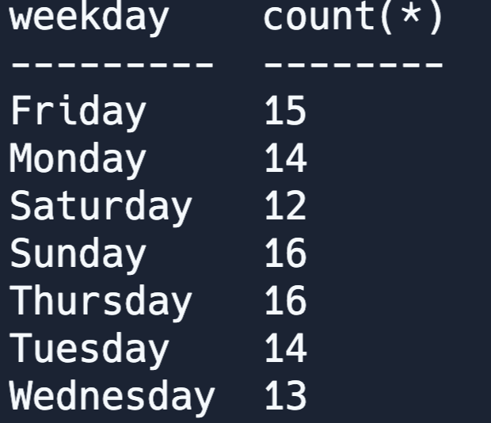

REPLIT Site: https://replit.com/@sqlSylvia/Instagram-Database


1. The business wants to reward the **users** who have been around the **longest**. 
   **Identify the 5 oldest users.**



``` sql 
SELECT * 
FROM users
ORDER BY created_at asc
LIMIT 5;
``` 

2. The business wants to target our inactive users with an email campaign find the users who have never posted a photo. Identify inactive Users (hint: Check USERS with no photo)
   
   
  
``` sql 
SELECT username
FROM users
LEFT JOIN photos
	ON users.id=photos.user_id
WHERE photos.id IS NULL;
```

3. The business is runnning a new contest to see who can get the most likes on single photos
- Identify the most popular **photo** and the **user** who created it.


``` sql 
SELECT 
    username,
	photos.id,
    photos.image_url, 
    count(likes.user_id) AS total
FROM photos
INNER JOIN likes 
    ON likes.photo_id=photos.id
INNER JOIN users
    ON photos.user_id = users.id
GROUP BY photos.id 
ORDER BY total DESC
LIMIT 1;
```  

4. A brand wants to know  which hashtags to use in a post.
  - **What are the top 5 most commonly used hashtags**


``` sql 


select t.tag_name as most_popular_tags from Tags t
  where t.id in 
  (select tag_id from Photo_Tags
                group by tag_id
                order by count(*) desc
                limit 5);
```

5. Which usernames posted the most number of comments?

``` sql 
select username, count(*)
  from Users
join comments on comments.user_id = Users.id
group by username
order by count(*) desc 
```


6. Who has the most # of photos?
  
``` sql 
select username, count(*) cnt_photos 
  from Users
join photos on Users.id = photos.user_id
group by username
order by cnt_photos desc 
limit 3
```

7.  Our investors want to know how many times does the average user post.
  
  To calulate average user posts
  [total number of photos] / [total number of users]

``` sql 
SELECT 
	(SELECT COUNT(*) FROM photos) / (SELECT COUNT(*) FROM users) AS avg;
```

7. What day of the week do most users register on ?
 here we need to figure out when to schedule an ad campgain
To use MySQL database for this question go to http://sqlfiddle.com/#!9/355e87d
### Answer 
``` sql 
SELECT 
     DAYNAME(created_at) AS day,
     count(*) as total
FROM users
GROUP BY day
ORDER BY total DESC
LIMIT 2;
```

### SQL Lite Answer:

``` sql 
WITH UserRegistrationDay AS 
(select
  case cast (strftime('%w', created_at) as integer)
  when 0 then 'Sunday'
  when 1 then 'Monday'
  when 2 then 'Tuesday'
  when 3 then 'Wednesday'
  when 4 then 'Thursday'
  when 5 then 'Friday'
  else 'Saturday' 
  end as weekday
from users)
SELECT weekday, count(*) 
from UserRegistrationDay
group by weekday;
```