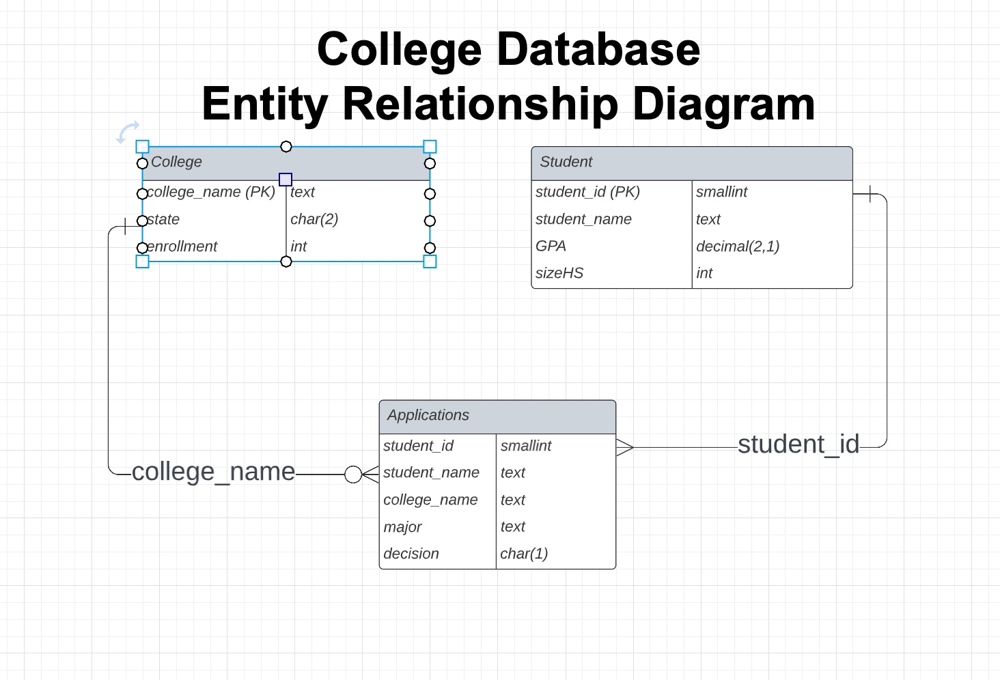

# College DB SQL Exercises

REPLIT Site: https://replit.com/@sqlSylvia/GDI-SQLIntro#main.sql

## How to access replit.com CollegeDB
1. To access and query the CollegeDB replit database, log into replit.com with your username and password.  If you don't have one, it is easy create from replit.com.
2. Fork the REPLIT site to your account.  This way make a private copy for you to use now and in the future.

## SQLLite References

REPLIT SQL uses the SQL database SQLLite.  As the name implies, it is lightweight version of SQL.  You may find some differences between the SQL from the [W3Schools SQL Database](https://www.w3schools.com/sql/trysql.asp?filename=trysql_editor)

- SQLLite Homepage - https://sqlite.org/index.html 
- SQLLite SELECT Language - https://www.sqlite.org/lang_select.html
- SQLLite Tutorial - https://www.sqlitetutorial.net/sqlite-show-tables/

## SQL Assignment
Using the SQLLite database in REPLIT, answer the following questions with a SQL Statement.

1. How many students applied to Standford?

2. What was the Average GPA of students that applied to Standford?

3. Which students did not apply to any colleges?

4. For each student, list their name, GPA and how many colleges they applied and how many colleges accepted them?

5. For each student, list their name, GPA and how many colleges accepted them?

6. Which students applied to a Computer Science program? Note: CS in the major column in Applications indicate a Computer Science.

7. How many/which students went to a college in California?

8. Which school has the smallest enrollment?

9. How many/which students applied to the college with the smallest enrollment?

10. Which is the most popular major to applied to?

11. Which is the least popular degree to applied to?

12. What is the Min, Max and Average high school size?

13. Which student came from the smallest high school?

14. Which student came from the largest high school?

