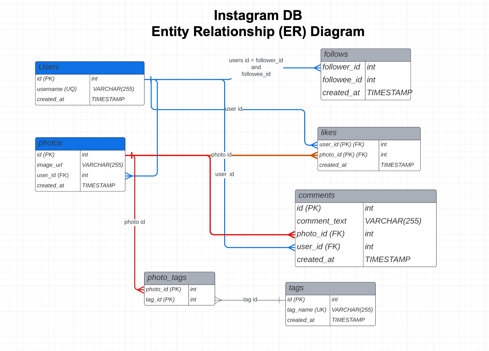

# REPLIT Instagram SqlLite DB 

REPLIT Site: [https://replit.com/@sqlSylvia/Instagram-Database](https://replit.com/@sqlSylvia/Instagram-Database#main.sql)


To copy this template to your replit account.
1. Click on https://replit.com/@sqlSylvia/Instagram-Database
2. Select "Use Template"
3. Sign into your replit account



## How to access replit.com InstagramDB
1. To access and query the InstagramDB replit database, log into replit.com with your username and password.  If you don't have one, it is easy create from replit.com.
2. Fork the REPLIT site to your account.  This way make a private copy for you to use now and in the future.


## SQLLite References

REPLIT SQL uses the SQL database SQLLite.  As the name implies, it is lightweight version of SQL.  You may find some differences between the SQL from the [W3Schools SQL Database](https://www.w3schools.com/sql/trysql.asp?filename=trysql_editor)


- SQLLite Homepage - https://sqlite.org/index.html 
- SQLLite SELECT Language - https://www.sqlite.org/lang_select.html
- SQLLite Tutorial - https://www.sqlitetutorial.net/sqlite-show-tables/

## SQL Assignment
Answer the following questions in the form of a SQL query in REPLIT.

1. The business wants to reward our users who have been around the longest. 
   Identify the 5 oldest users.
2. The business wants to target our inactive users with an email campaign 
  find the users who have never posted a photo.
   Identify inactive Users (hint: Check USERS with no photo)

3. The business is runnning a new contest to see who can get the most likes on single photos
  - IDENTIFY MOST POPULAR PHOTO AND USER WHO CREATED IT
  - WHO WON??!!


4.   Our investors want to know how many times does the average user post.
  - Use the following calculation for "average user posts"
  ```
            [total number of photos] / [total number of users]
  ```
  - CALCULATE AVG NUMBER OF PHOTOS PER USER
  - Calculate the average number of photos per user


5. A brand wants to know  which hashtags to use in a post.
  - What are the top 5 most commonly used hashtags


6.  The business needs to figure out when to schedule an ad campgain
- What day of the week do most users register on ?
- To use MySQL database for this question go to http://sqlfiddle.com/#!9/355e87d

