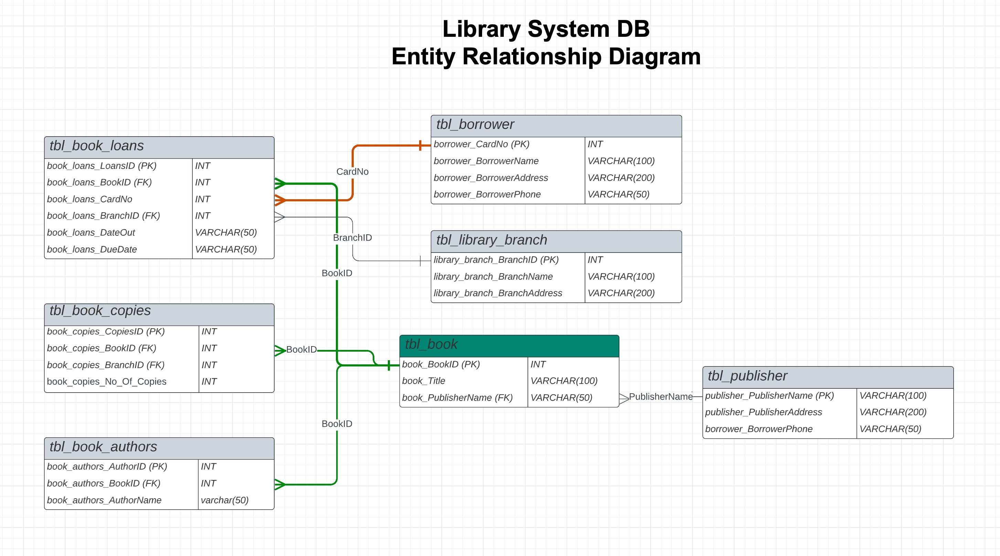

# REPLIT LibrarySystem SqlLite DB 
REPLIT Site:https://replit.com/@sqlSylvia/LibrarySystem 

## How to access replit.com LibrarySystem
1. To access and query the InstagramDB replit database, log into replit.com with your username and password.  If you don't have one, it is easy create from replit.com.
2. Fork the REPLIT site to your account.  This way make a private copy for you to use now and in the future.

## SQLLite References

REPLIT SQL uses the SQL database SQLLite.  As the name implies, it is lightweight version of SQL.  You may find some differences between the SQL from the [W3Schools SQL Database](https://www.w3schools.com/sql/trysql.asp?filename=trysql_editor)

- SQLLite Homepage - https://sqlite.org/index.html 
- SQLLite SELECT Language - https://www.sqlite.org/lang_select.html

Questions:
1. How many copies of the book titled "The Lost Tribe" are owned by the library branch whose name is "Sharpstown"? 

2.  How many copies of the book titled "The Lost Tribe" are owned by each library branch? 

3.  Retrieve the names of all borrowers who do not have any books checked out.

4. For each book that is loaned out from the "Sharpstown" branch and whose DueDate is today, retrieve the book title, the borrower's name, and the borrower's address. 

5. For each library branch, retrieve the branch name and the total number of books loaned out from that branch.  

6. - Retrieve the names, addresses, and number of books checked out for all borrowers who have more than five books checked out. 

7.  For each book authored by "Stephen King", retrieve the title and the number of copies owned by the library branch whose name is "Central".
